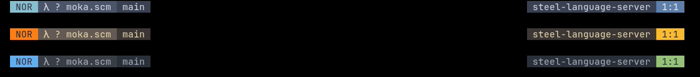

# moka.hx

A fully configurable statusline and bufferline for [Helix](https://github.com/helix-editor/helix/).

Sections, segments, colors, shapes, spacing — all defined from `init.scm`, nothing hardcoded.


---

## Installation

**1. Install the plugin-enabled fork of Helix** by following the instructions [here](https://github.com/mattwparas/helix/blob/steel-event-system/STEEL.md).

**2. Install moka.hx via forge:**

```sh
forge pkg install --git https://github.com/Ra77a3l3-jar/moka.hx.git
```

**3. Load the plugin** by adding this to your `init.scm`:

```scheme
(require "moka/moka.scm")

(moka-configure!
 #:sections
 (list
  (moka-section (list (moka-segment 'mode) (moka-segment 'file)) #:align 'left)
  (moka-section (list (moka-segment 'lsp) (moka-segment 'git-branch) (moka-segment 'position)) #:align 'right)))

(moka-enable!)
```

`(moka-disable!)` restores Helix's default statusline.

---

## Usage

| Segment | Shows |
|---|---|
| `'mode` | `NOR` / `INS` / `SEL`, colored from the theme |
| `'file` | File icon + git status + name |
| `'git-branch` | Current branch |
| `'lsp` | Active LSP client name(s) |
| `'diagnostics` | Hint/info/warning/error counts, colored from the theme |
| `'position` | `line:column` |
| `'spacer` / `'separator` | Blank space / `\|` |

Each segment takes `#:fg`, `#:bg`, `#:bubble?` (`#t` round, `'angled` sharp, `#f` flat block), and `#:gap` (spacing to the next one, `0` = touching).

---

## Gallery

**Classic lualine**



<details>
<summary>Config</summary>

```scheme
;; Nord
(moka-configure!
 #:sections
 (list
  (moka-section (list (moka-segment 'mode #:bg "#88c0d0" #:fg "#2e3440" #:bubble? #f #:gap 0)
                       (moka-segment 'file #:bg "#4c566a" #:fg "#d8dee9" #:bubble? #f #:gap 0)
                       (moka-segment 'git-branch #:bg "#3b4252" #:fg "#d8dee9" #:bubble? #f))
                #:align 'left)
  (moka-section (list (moka-segment 'lsp #:bg "#3b4252" #:fg "#d8dee9" #:bubble? #f #:gap 0)
                       (moka-segment 'position #:bg "#5e81ac" #:fg "#eceff4" #:bubble? #f))
                #:align 'right)))
(moka-enable!)
```

</details>

**Ghost Mode**


<details>
<summary>Config</summary>

```scheme
(moka-configure!
 #:sections
 (list
  (moka-section (list (moka-segment 'mode #:fg "#8a8a8a" #:bg #f)
                       (moka-segment 'file #:fg "#8a8a8a"))
                #:align 'left)
  (moka-section (list (moka-segment 'git-branch #:fg "#8a8a8a" #:bg #f)
                       (moka-segment 'lsp #:fg "#8a8a8a")
                       (moka-segment 'position #:fg "#8a8a8a"))
                #:align 'right)))
(moka-enable!)
```

</details>

**Tokyo Night**


<details>
<summary>Config</summary>

```scheme
(moka-configure!
 #:sections
 (list
  (moka-section (list (moka-segment 'mode #:bg "#7aa2f7" #:fg "#1a1b26" #:bubble? 'angled #:gap 1)
                       (moka-segment 'file #:bg "#bb9af7" #:fg "#1a1b26" #:bubble? 'angled #:gap 1)
                       (moka-segment 'git-branch #:bg "#7dcfff" #:fg "#1a1b26" #:bubble? 'angled))
                #:align 'left)
  (moka-section (list (moka-segment 'lsp #:bg "#9ece6a" #:fg "#1a1b26" #:bubble? 'angled)
                       (moka-segment 'position #:bg "#ff9e64" #:fg "#1a1b26" #:bubble? 'angled))
                #:align 'right)))
(moka-enable!)
```

</details>

**Rosé Pine**


<details>
<summary>Config</summary>

```scheme
(moka-configure!
 #:sections
 (list
  (moka-section (list (moka-segment 'mode #:fg "#908caa" #:bg #f)
                       (moka-segment 'file #:fg "#908caa"))
                #:align 'left)
  (moka-section (list (moka-segment 'git-branch #:bg "#c4a7e7" #:fg "#191724" #:bubble? #t)) #:align 'center)
  (moka-section (list (moka-segment 'lsp #:fg "#ebbcba")
                       (moka-segment 'position #:fg "#ebbcba"))
                #:align 'right)))
(moka-enable!)
```

</details>

---

## Bufferline

moka.hx also ships a bufferline, replacing Helix's native one. Same styling options: pills, angled caps, flat blocks.

**Catppuccin**


<details>
<summary>Config</summary>

```scheme
(moka-bufferline-configure!
 #:active (moka-buffer-style #:bg "#89b4fa" #:fg "#1e1e2e" #:bubble? #t)
 #:inactive (moka-buffer-style #:bg "#313244" #:fg "#a6adc8" #:bubble? #t)
 #:gap 0)
(moka-bufferline-enable!)
```

</details>

**Tokyo Night**


<details>
<summary>Config</summary>

```scheme
(moka-bufferline-configure!
 #:active (moka-buffer-style #:bg "#bb9af7" #:fg "#1a1b26" #:bubble? 'angled)
 #:inactive (moka-buffer-style #:bg "#24283b" #:fg "#7dcfff" #:bubble? 'angled)
 #:gap 0)
(moka-bufferline-enable!)
```

</details>

**Gruvbox**


<details>
<summary>Config</summary>

```scheme
(moka-bufferline-configure!
 #:active (moka-buffer-style #:bg "#fabd2f" #:fg "#282828" #:bubble? #f)
 #:inactive (moka-buffer-style #:bg "#3c3836" #:fg "#a89984" #:bubble? #f)
 #:gap 0)
(moka-bufferline-enable!)
```

</details>

## Notes

- Diagnostics icons are coming in the next update, once a PR to the [mattwparas Helix fork](https://github.com/mattwparas/helix) lands.
- Known bug, with [forest.hx](https://github.com/Ra77a3l3-jar/forest.hx), the file explorer sidebar covers the statusline and bufferline. Fix coming in the next commit.
